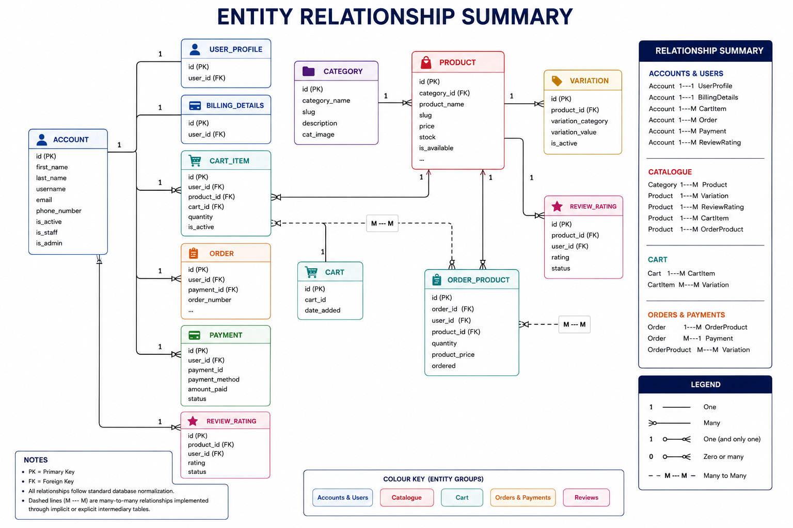
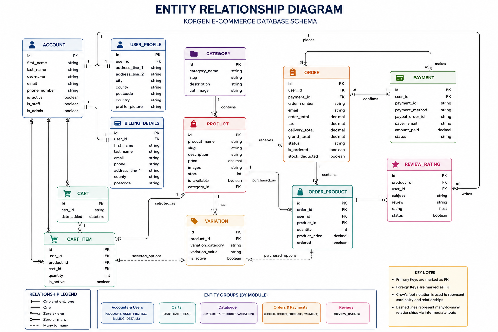
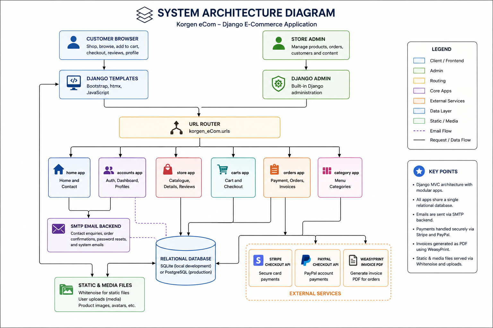
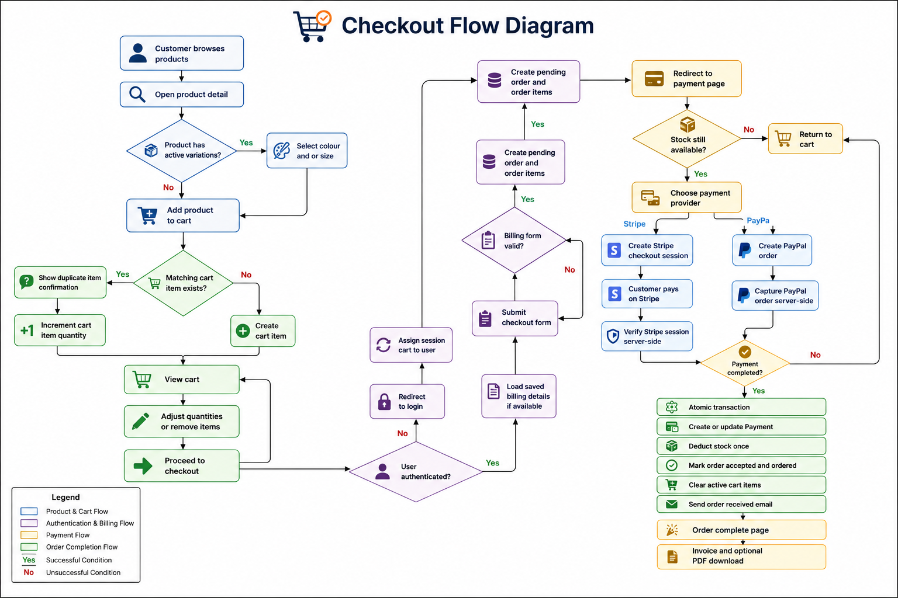
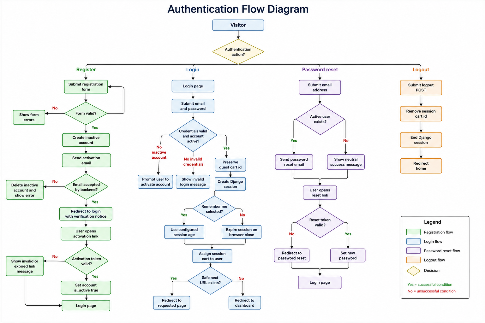

# Korgen eCommerce

Korgen eCommerce is a full-stack Django online store built for the Code Institute Milestone Project 4 assessment. The application provides a complete shopping experience: product browsing, category filtering, product variations, guest and authenticated carts, checkout, payment processing, order history, invoices, customer reviews, account management, and a contact workflow for customer enquiries.

The project demonstrates server-side Django development, relational database modelling, authentication, payment integration, email workflows, progressive enhancement with htmx, and test-driven validation of critical business logic.

## Table of Contents

- [Project Overview](#project-overview)
- [UX](#ux)
- [User Stories](#user-stories)
- [Database Design](#database-design)
- [Diagrams](#diagrams)
- [Features](#features)
- [Security](#security)
- [Testing](#testing)
- [Deployment](#deployment)
- [Technologies Used](#technologies-used)
- [Bugs and Fixes](#bugs-and-fixes)
- [Credits](#credits)
- [Future Features](#future-features)

## Project Overview

Korgen is designed as a multi-category e-commerce platform for customers who want to browse products, manage a cart, place orders securely, and review products after purchase. The site supports both guest shopping and registered user workflows.

### Business Goals

- Provide a trustworthy shopping experience with clear product information.
- Allow users to browse, filter, and search products efficiently.
- Support secure authentication and account management.
- Enable checkout through external payment providers.
- Maintain reliable order and invoice records.
- Allow verified purchasers to leave product reviews.
- Provide a professional contact channel for customer enquiries.

### Target Users

- **Guest shoppers** who want to browse products and add items to a cart without creating an account immediately.
- **Registered customers** who want saved billing details, order history, and account management.
- **Store administrators** who need to manage products, categories, orders, and customer data through Django Admin.
- **Assessors and developers** reviewing the project for code quality, UX, testing, and deployment readiness.

## UX

### Design Approach

The UX focuses on clarity, predictable navigation, and a conventional e-commerce journey. The interface uses Bootstrap components, responsive layouts, product cards, clear calls to action, and progressive enhancement for smoother interactions.

### User Experience Goals

- Users can identify the site purpose immediately from the homepage and navigation.
- Product cards present key information clearly: image, name, price, rating, and action.
- Store filtering and pagination are usable without JavaScript and enhanced with htmx when JavaScript is available.
- Cart and checkout pages prioritize transactional clarity over decorative layout.
- Forms provide server-side validation and user feedback.
- Contact enquiries are handled through a dedicated contact page rather than relying only on `mailto:`.

### Information Architecture

- **Home**: featured products and primary shopping entry point.
- **Store**: product catalogue, filtering, pagination, and category browsing.
- **Product Detail**: product image, variations, stock status, add-to-cart action, and reviews.
- **Cart**: line items, quantity controls, totals, delivery, and checkout action.
- **Checkout**: billing details and order creation.
- **Payment**: Stripe and PayPal payment options.
- **Order Complete / Invoice**: purchase confirmation and order records.
- **Account Dashboard**: profile, order history, password management, and saved details.
- **Contact**: customer enquiry form and direct support details.

### Responsive Design

The application uses Bootstrap's grid and responsive utilities. The product catalogue, cart, account pages, and contact form adapt from multi-column desktop layouts to stacked mobile layouts.

### Progressive Enhancement

htmx is used where it improves perceived speed without replacing Django's core server-rendered architecture:

- Store filtering updates the product browser section without a full page reload.
- Store pagination updates the product browser section and preserves normal link fallback.
- Product review submission updates the review section inline.
- Product rating summary is updated out-of-band after htmx review submissions.

If htmx or JavaScript is unavailable, the application still functions through normal Django GET and POST requests.

## Agile Methodology

The project was developed using an Agile mindset, breaking the work into user-focused increments. Features were prioritized according to business value, assessment requirements, and risk.

### Planning Method

The project can be represented with a Kanban workflow:

- **Backlog**: desired features, improvements, and known technical debt.
- **To Do**: selected tasks for the current development cycle.
- **In Progress**: actively implemented features.
- **Testing**: code under manual and automated verification.
- **Done**: completed, tested, and documented features.


#### Must Have

- Product catalogue
- Product detail pages
- Shopping cart
- Checkout flow
- User registration and login
- Order persistence
- Payment integration
- Admin management
- Secure environment configuration

#### Should Have

- Product filtering and pagination
- Product variations
- Product reviews
- Order invoices
- Saved billing details
- Contact form
- Email notifications

#### Could Have

- htmx-enhanced interactions
- PDF invoice downloads
- Remember-me login sessions
- Free delivery threshold

#### Won't Have for Initial Release

- Wishlist
- Product comparison
- Real-time stock alerts
- Admin analytics dashboard
- Full-text search engine

## User Stories

### Shopper

- As a shopper, I want to browse all available products so that I can decide what to purchase.
- As a shopper, I want to filter products by category, size, and price so that I can find relevant items faster.
- As a shopper, I want to view product details so that I can understand price, description, stock, rating, and available options.
- As a shopper, I want to add products with selected variations to my cart so that I can purchase the correct item.
- As a shopper, I want to adjust or remove items in my cart so that my order is accurate before checkout.
- As a shopper, I want to see delivery, tax, and grand total values before paying so that there are no hidden costs.
- As a shopper, I want to contact the store owner through a form so that I can ask questions without configuring an email client.

### Registered Customer

- As a registered customer, I want to create an account so that I can manage my orders and profile.
- As a registered customer, I want email activation so that my account is protected from invalid signups.
- As a registered customer, I want to log in securely so that I can access my dashboard.
- As a registered customer, I want my guest cart assigned to my account after login so that I do not lose selected items.
- As a registered customer, I want to view my order history so that I can track previous purchases.
- As a registered customer, I want to download invoices so that I have proof of purchase.
- As a registered customer, I want to leave a review only for purchased products so that reviews remain trustworthy.

### Store Owner / Admin

- As a store owner, I want to manage categories, products, variations, orders, and users through Django Admin so that I can operate the shop.
- As a store owner, I want payment records saved so that completed transactions can be audited.
- As a store owner, I want stock deducted once after successful payment so that inventory remains accurate.
- As a store owner, I want contact enquiries delivered to a monitored inbox so that I can respond to customers.

### Developer / Maintainer

- As a developer, I want environment variables separated from source code so that secrets are not committed.
- As a developer, I want automated tests for critical flows so that regressions are easier to catch.
- As a developer, I want reusable templates and partials so that UI changes are easier to maintain.

## Database Design

The application uses Django's ORM with a relational database. SQLite is used locally by default, while PostgreSQL-compatible configuration is supported through `dj-database-url`.

### Core Data Models

#### Account

Custom user model using email as the login identifier.

Key fields:

- `first_name`
- `last_name`
- `username`
- `email`
- `phone_number`
- `is_active`
- `is_staff`
- `is_admin`
- `is_superadmin`

Relationships:

- One `Account` can have many `CartItem` records.
- One `Account` can have many `Order` records.
- One `Account` can have many `Payment` records.
- One `Account` can have many `ReviewRating` records.
- One `Account` has one `UserProfile`.
- One `Account` has one `BillingDetails`.

#### UserProfile

Stores extended profile and address information.

Key fields:

- `address_line_1`
- `address_line_2`
- `city`
- `county`
- `postcode`
- `country`
- `profile_picture`

#### BillingDetails

Stores reusable checkout details for authenticated customers.

Key fields:

- `first_name`
- `last_name`
- `email`
- `phone`
- `address_line_1`
- `address_line_2`
- `county`
- `postcode`

#### Category

Groups products into browsable catalogue sections.

Key fields:

- `category_name`
- `slug`
- `description`
- `cat_image`

Relationships:

- One `Category` has many `Product` records.

#### Product

Represents an item available for purchase.

Key fields:

- `product_name`
- `slug`
- `description`
- `price`
- `images`
- `stock`
- `is_available`
- `category`

Relationships:

- One `Product` belongs to one `Category`.
- One `Product` has many `Variation` records.
- One `Product` has many `ReviewRating` records.
- One `Product` can appear in many `CartItem` and `OrderProduct` records.

#### Variation

Stores selectable product options.

Key fields:

- `product`
- `variation_category`
- `variation_value`
- `is_active`

Supported variation categories:

- `color`
- `size`

#### ReviewRating

Stores customer reviews and ratings.

Key fields:

- `product`
- `user`
- `subject`
- `review`
- `rating`
- `ip`
- `status`

Business rule:

- New reviews are restricted to authenticated users who have purchased the product.

#### Cart

Stores a guest/session cart identifier.

Key fields:

- `cart_id`
- `date_added`

#### CartItem

Stores products selected for purchase.

Key fields:

- `user`
- `product`
- `variations`
- `cart`
- `quantity`
- `is_active`

Business rules:

- Guest users are tracked by session cart.
- Authenticated users are linked to their account.
- Selected variations are used to distinguish otherwise identical products.

#### Payment

Stores payment provider transaction details.

Key fields:

- `user`
- `payment_id`
- `payment_method`
- `paypal_order_id`
- `payer_email`
- `payer_name`
- `currency`
- `amount_paid`
- `status`
- `transaction_data`

#### Order

Stores checkout and delivery details.

Key fields:

- `user`
- `payment`
- `order_number`
- `first_name`
- `last_name`
- `email`
- `phone`
- `address_line_1`
- `address_line_2`
- `county`
- `postcode`
- `order_total`
- `tax`
- `delivery_total`
- `grand_total`
- `status`
- `ip`
- `is_ordered`
- `stock_deducted`

Business rules:

- Order numbers are generated after first save.
- Orders are not considered paid until payment confirmation succeeds.
- Stock is deducted once only.

#### OrderProduct

Stores purchased line items.

Key fields:

- `order`
- `user`
- `product`
- `variations`
- `quantity`
- `product_price`
- `ordered`

### Entity Relationship Summary



## Diagrams

The diagrams below provide a visual overview of the application's data relationships, system structure, checkout journey, and authentication process. They support the written documentation by making the main models, app responsibilities, and user flows easier to understand at a glance.


### Entity Relationship Diagram

This diagram shows the core database relationships between users, products, categories, carts, orders, payments, billing details, and reviews. It demonstrates how customer activity moves from browsing and cart storage through to completed orders, payment records, and verified product reviews.




### System Architecture Diagram

This diagram outlines how the main Django apps interact with the browser, templates, database, static/media files, email service, and external payment providers. It helps explain the separation of responsibilities between catalogue browsing, accounts, carts, checkout, payments, invoices, and contact enquiries.




### Checkout Flow Diagram

This diagram follows the customer journey from selecting a product through cart management, checkout, payment provider selection, server-side payment verification, stock deduction, cart clearing, confirmation email delivery, and invoice access.




### Authentication Flow Diagram

This diagram documents the account lifecycle, including registration, activation email handling, login, remember-me session behaviour, guest cart assignment, password reset, and logout. It highlights the validation and redirect decisions that protect the customer account flow.




## Features

### Existing Features

The following features are currently implemented in the application. They cover the main customer shopping journey, account management, store owner administration, payment handling, and supporting customer service workflows.

#### Homepage

- Responsive landing area.
- Featured products.
- Product cards with image, name, rating, and action.

#### Store Catalogue

- All products view.
- Category filtering.
- Size filtering.
- Price range filtering.
- Pagination.
- htmx-enhanced product browser updates.
- Graceful fallback to normal GET requests.

#### Product Detail

- Product image.
- Product description.
- Price.
- Average rating and review count.
- Colour and size variation selection where available.
- Stock-aware add-to-cart action.
- Sold-out messaging.

#### Shopping Cart

- Guest and authenticated carts.
- Product quantity display.
- Increment and decrement controls.
- Remove item workflow.
- Product variation display.
- Tax, delivery, and grand total calculation.
- Free delivery threshold messaging.

#### Checkout

- Authenticated checkout.
- Guest cart assignment after login.
- Saved billing details for returning customers.
- Order creation before payment.
- Cart item conversion into order line items.

#### Payments

- Stripe checkout session payload generation.
- PayPal order create/capture support.
- Payment records persisted.
- Order status updated after successful payment.
- Stock deducted after payment confirmation.
- Duplicate stock deduction prevented.

#### Orders and Invoices

- Order completion page.
- Customer order history.
- Invoice view.
- PDF invoice download via WeasyPrint where system dependencies are available.
- Invoice access restricted to the order owner.

#### Reviews

- Authenticated users can submit reviews.
- Purchase validation prevents reviews from users who have not bought the product.
- Existing reviews can be updated.
- htmx-enhanced inline review submission.
- Review list and product rating summary update without a full page reload.

#### Accounts

- Custom user model.
- Registration.
- Email activation.
- Login and logout.
- Remember-me session behaviour.
- Password reset.
- Profile editing.
- Password change.
- Dashboard.
- Order history.

#### Contact Page

- Dedicated `/contact/` page.
- Contact form with server-side validation.
- Enquiry email sent to the configured owner inbox.
- Customer email stored as `reply_to`.
- Direct email and phone details displayed as fallback contact methods.

#### Admin

- Django Admin support for managing database records.
- Staff and superuser permissions.
- Custom account model compatible with admin workflows.

## Security

Security considerations are addressed throughout the application.

### Authentication and Authorisation

- Custom `Account` model uses email as the primary login field.
- Passwords are stored using Django's password hashing system.
- Account activation is required before login.
- Sensitive account pages require authentication.
- Invoice views are restricted to the authenticated owner of the order.
- Admin features are protected by Django staff/superuser permissions.

### CSRF Protection

- Django CSRF middleware is enabled.
- POST forms include Django CSRF tokens.
- htmx POST requests reuse normal Django CSRF handling.

### Environment Variables

Secrets and deployment-specific settings are read from environment variables through `python-decouple`.

Examples:

```text
SECRET_KEY
DEBUG
DEVELOPMENT
ALLOWED_HOSTS
DATABASE_URL
EMAIL_HOST
EMAIL_HOST_USER
EMAIL_HOST_PASSWORD
DEFAULT_FROM_EMAIL
CONTACT_EMAIL
PAYPAL_CLIENT_ID
PAYPAL_CLIENT_SECRET
PAYPAL_MODE
STRIPE_PUBLIC_KEY
STRIPE_SECRET_KEY
STRIPE_ALLOW_LIVE_PAYMENTS
```

### Payment Safety

- Stripe and PayPal credentials are stored in environment variables.
- The Stripe checkout payload does not request saved cards.
- Live Stripe payments can be blocked through `STRIPE_ALLOW_LIVE_PAYMENTS`.
- PayPal and Stripe payment states are confirmed server-side before marking orders as paid.
- Payment provider transaction data is persisted for audit purposes.

### Email Safety

- Contact form messages are sent from `DEFAULT_FROM_EMAIL`.
- Customer email addresses are used as `reply_to`, avoiding spoofed sender addresses.
- In development, console email backend can be used to avoid accidental real sending.

### Data Validation

- Django forms validate user-submitted data.
- Contact form validates required fields, email format, and minimum message length.
- Review form validation prevents missing ratings.
- Price filter parsing rejects invalid and negative values.

### Static and Media Files

- Whitenoise is configured for static file serving in deployment.
- Uploaded media is stored under `MEDIA_ROOT`.

## Testing

Testing combines automated Django tests, request-level smoke checks, and manual user journey validation.

### Automated Tests

Run the full suite:

```bash
.venv/bin/python manage.py test
```

Run focused suites:

```bash
.venv/bin/python manage.py test home
.venv/bin/python manage.py test accounts
.venv/bin/python manage.py test carts
.venv/bin/python manage.py test orders
.venv/bin/python manage.py test store
```

Run system checks:

```bash
.venv/bin/python manage.py check
```

### Current Automated Test Coverage

#### Home

- Contact page renders.
- Valid contact form sends an email to configured support inbox.
- Invalid contact form does not send an email.

#### Accounts

- Registration sends an activation email.
- Production configuration prevents accidental console-email backend usage.
- Login without remember-me expires when the browser closes.
- Login with remember-me uses configured session age.

#### Carts

- Delivery is flat rate below the free delivery threshold.
- Delivery is free at the configured threshold.
- Cart totals include product total, tax, delivery, grand total, and quantity.

#### Orders

- Stripe checkout payload uses card-only checkout and does not save cards.
- Order owner can view a paid invoice.
- Pending order invoice is unavailable.
- Other users cannot view another customer's invoice.
- Order owner can download an invoice PDF.
- PDF endpoint returns `503` when WeasyPrint is unavailable.
- PDF endpoint returns `503` when native WeasyPrint libraries are missing.
- Paid order stock deduction runs once.

### Manual Testing Checklist

#### Navigation

- Home link loads the homepage.
- Store link loads the product catalogue.
- Category menu routes to category-specific product listings.
- Contact link loads `/contact/`.
- Cart link loads the cart page.
- Authenticated dashboard link loads the account dashboard.

#### Store

- Product grid displays available products.
- Category links filter results.
- Size filter changes product results.
- Price filter changes product results.
- Pagination moves between product pages.
- htmx updates the store browser without full page reload.
- Browser fallback still works when JavaScript is disabled.

#### Product Detail

- Product detail route loads from product card links.
- Product image, name, price, description, and ratings display.
- Variation fields appear only where active variations exist.
- Add-to-cart action respects required variation selections.
- Sold-out products show sold-out messaging.

#### Cart and Checkout

- Product can be added to cart.
- Cart item quantities can be increased or decreased.
- Items can be removed.
- Totals update after quantity changes.
- Checkout redirects unauthenticated users to login.
- Authenticated users can submit billing details.

#### Payment

- Stripe payment button/session creation works with configured test credentials.
- PayPal create and capture endpoints work with configured sandbox credentials.
- Successful payment marks order as ordered.
- Stock is deducted once.
- Order confirmation email is sent.

#### Reviews

- Unauthenticated users receive a sign-in message.
- Users who have not purchased the product receive a purchase-required message.
- Purchased users can submit a review.
- Existing review updates correctly.
- htmx updates the review section inline.

#### Contact

- Contact page displays form and support details.
- Valid form submits and redirects with a success message.
- Invalid form shows validation errors.
- Owner inbox receives contact enquiry.
- Reply action uses the customer's email address.

### Validation

Recommended validation tools:

- W3C HTML Validator
- W3C CSS Validator
- Lighthouse
- Django `manage.py check`
- Browser developer tools for console/network errors

## Deployment

The project is deployment-ready for a platform such as Heroku, Render, Railway, or another WSGI-compatible host.

### Local Setup

1. Clone the repository:

```bash
git clone <repository-url>
cd Korgen-eCommerce-MSP4
```

2. Create and activate a virtual environment:

```bash
python -m venv .venv
source .venv/bin/activate
```

3. Install dependencies:

```bash
pip install -r requirements.txt
```

4. Create `.env` and configure required variables:

```text
SECRET_KEY=<your-secret-key>
DEBUG=True
DEVELOPMENT=True
ALLOWED_HOSTS=localhost,127.0.0.1
DATABASE_URL=sqlite:///db.sqlite3
EMAIL_BACKEND=django.core.mail.backends.console.EmailBackend
DEFAULT_FROM_EMAIL=no-reply@localhost
CONTACT_EMAIL=owner@example.com
```

5. Apply migrations:

```bash
python manage.py migrate
```

6. Create a superuser:

```bash
python manage.py createsuperuser
```

7. Run the development server:

```bash
python manage.py runserver
```

### Production Environment Variables

At minimum:

```text
SECRET_KEY
DEBUG=False
DEVELOPMENT=False
ALLOWED_HOSTS
DATABASE_URL
EMAIL_BACKEND=django.core.mail.backends.smtp.EmailBackend
EMAIL_HOST
EMAIL_PORT
EMAIL_USE_TLS
EMAIL_HOST_USER
EMAIL_HOST_PASSWORD
DEFAULT_FROM_EMAIL
CONTACT_EMAIL
```

For payments:

```text
PAYPAL_CLIENT_ID
PAYPAL_CLIENT_SECRET
PAYPAL_CURRENCY
PAYPAL_MODE
STRIPE_PUBLIC_KEY
STRIPE_SECRET_KEY
STRIPE_CURRENCY
STRIPE_ALLOW_LIVE_PAYMENTS
```

For delivery configuration:

```text
DELIVERY_FLAT_RATE
DELIVERY_FREE_THRESHOLD
```

### Static Files

Static configuration:

- `STATIC_URL = '/static/'`
- `STATIC_ROOT = BASE_DIR / 'staticfiles'`
- Whitenoise storage: `whitenoise.storage.CompressedManifestStaticFilesStorage`

Collect static files:

```bash
python manage.py collectstatic
```

### Procfile

The included `Procfile` starts the application with Gunicorn:

```text
web: gunicorn korgen_eCom.wsgi:application
```

### Deployment Checklist

- Set `DEBUG=False`.
- Set secure `SECRET_KEY`.
- Configure production `ALLOWED_HOSTS`.
- Configure production database.
- Configure SMTP email credentials.
- Configure owner `CONTACT_EMAIL`.
- Configure Stripe and PayPal credentials.
- Run migrations.
- Run collectstatic.
- Create superuser.
- Smoke test home, store, cart, checkout, payment, account, invoice, and contact flows.

## Technologies Used

### Languages

- Python
- HTML
- CSS
- JavaScript

### Frameworks and Libraries

- Django 6.0.2
- Django Allauth
- Bootstrap 5
- Bootstrap Icons
- Font Awesome
- htmx
- GSAP
- Whitenoise
- Gunicorn
- Pillow
- WeasyPrint
- dj-database-url
- python-decouple

### Payment and External Services

- Stripe Checkout
- PayPal Checkout
- SMTP email provider

### Database

- SQLite for local development.
- PostgreSQL-compatible deployment through `DATABASE_URL`.

### Development Tools

- Git
- Django TestCase and SimpleTestCase
- Browser developer tools
- W3C validators
- Lighthouse

## Bugs and Fixes

### Contact Link Relied on `mailto:`

**Issue:** The navbar originally used a direct `mailto:` link. This depends on the user's local email client and can fail on many browsers or devices.

**Fix:** Added a dedicated `/contact/` page with a Django `ContactForm`, server-side validation, SMTP email sending, and owner inbox configuration through `CONTACT_EMAIL`.

### Contact Owner Inbox Was Implicit

**Issue:** Contact enquiries would fall back to `EMAIL_HOST_USER` or `DEFAULT_FROM_EMAIL` when `CONTACT_EMAIL` was not explicitly configured.

**Fix:** Added `CONTACT_EMAIL=appAlchemist.26@gmail.com` to the local environment configuration and documented the setting.

### Store Filtering Required Full Page Reload

**Issue:** Category, filter, and pagination interactions reloaded the whole store page.

**Fix:** Extracted the store browser into a partial and added htmx attributes so product results update inline while preserving normal link/form fallback.

### Review Submission Required Full Page Reload

**Issue:** Submitting a review redirected the full product detail page, interrupting the user's context.

**Fix:** Extracted the review area into a partial and added htmx POST handling. The review area and rating summary now update inline for htmx requests.

### Product Rating Summary Could Become Stale

**Issue:** After htmx review submission, the review list could update while the top product rating summary remained unchanged.

**Fix:** Added an htmx out-of-band update for `#productRatingSummary`.

### Invoice Access Risk

**Issue:** Invoice views must not expose customer order data to other users.

**Fix:** Tests confirm only the owner can view paid invoices and other users receive a not-found response.

### PDF Generation Dependency Risk

**Issue:** WeasyPrint depends on native system libraries and can fail if unavailable in deployment.

**Fix:** Tests verify the PDF endpoint returns `503` when WeasyPrint or required native libraries are unavailable.

### Stock Deduction Duplication Risk

**Issue:** Payment callbacks can be retried, which risks deducting stock multiple times.

**Fix:** The order model tracks `stock_deducted`; tests confirm stock deduction happens once.

## Credits

### Code and Architecture

- Developed as a Code Institute MSP4 Django e-commerce portfolio project.
- Django project structure follows standard Django app separation by responsibility:
  - `home`
  - `accounts`
  - `category`
  - `store`
  - `carts`
  - `orders`

### Frameworks and Documentation

- Django documentation
- Django Allauth documentation
- Bootstrap documentation
- htmx documentation
- Stripe API documentation
- PayPal API documentation
- WeasyPrint documentation
- Whitenoise documentation

### Assets

- Product and interface images are stored in the project's static and media directories.
- Icons provided by Bootstrap Icons and Font Awesome.

### Educational Context

- Built for Code Institute Milestone Project 4 assessment requirements.

## Future Features

- Customer confirmation email after contact form submission.
- Wishlist functionality.
- Product comparison.
- Product stock alerts.
- Admin sales analytics dashboard.
- Coupon and promotion codes.
- Advanced search with full-text ranking.
- Product sorting by price, rating, and newest arrivals.
- Saved multiple delivery addresses.
- Guest checkout option.
- Webhook-based payment confirmation.
- Automated accessibility test integration.
- More comprehensive test coverage for store and review views.
- Cloud media storage for production uploads.
- Customer support ticket tracking.
